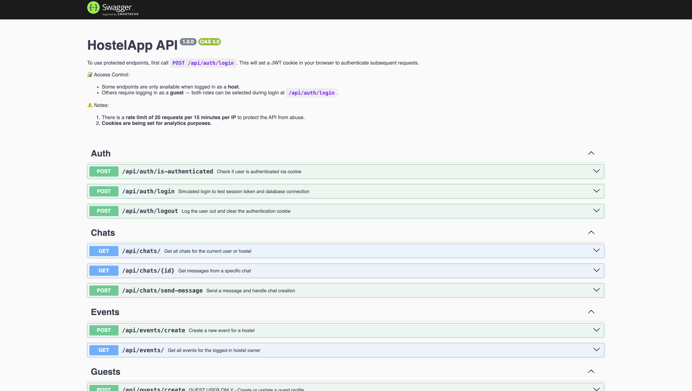
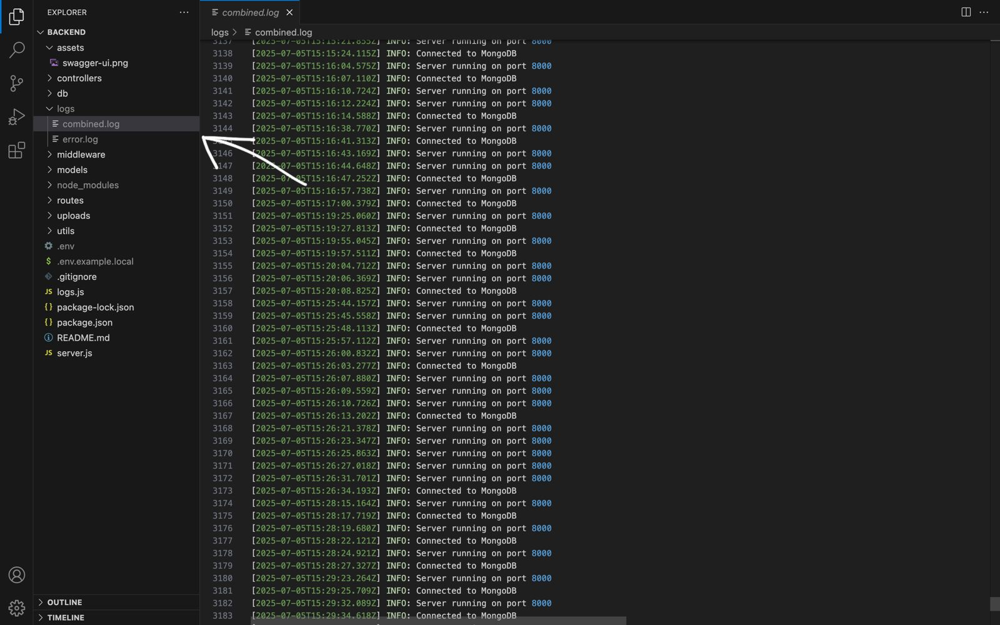

# HostelApp backend with Express.js and MongoDB
REST API backend for managing hostels, rooms, messaging and payments—built with Express, MongoDB, Socket.IO & Stripe.

## Tech Stack

- **Node.js** & **Express**  
- **MongoDB** (Mongoose ODM)  
- **Socket.IO** for real‑time messaging  
- **Stripe** for payments  
- **Winston** + **Morgan** for logging  
- **dotenv** for environment configuration  
- **Multer** for file uploads  

## API Documentation (Swagger)

You can explore and test all available endpoints using the **Swagger UI**:

> **Live API Docs:** [https://hostelapp-heemdbgqgkdnb7ce.northeurope-01.azurewebsites.net/api-docs]

> _Note: Hosted on Azure App Service. It may take a few seconds to respond initially, as the server spins up on first request._

### Authentication Required
To use the protected endpoints:

1. First call `POST /api/auth/login` with valid credentials.
2. A `JWT` cookie will be set automatically.
3. After that, you'll be able to access protected routes using your browser session.

It will automatically include the cookie in subsequent requests if you're using the same browser session.  
⚠️ **Notes:** 
- The API is protected with a **rate limit of 20 requests per 15 minutes per IP**.
- This project also uses my own lib [api-traffic-analyzer](https://github.com/marinspira/api-traffic-analyzer) to log access activity via cookies for analytics purposes. 

## Features

**Authentication & Authorization**  
  - JWT sign‑up / login  
  - Protected routes via `auth` middleware  

**Resource CRUD**  
  - Guests, Hostels, Rooms, Reservations, Events  

**Payments**  
  - Stripe integration (create payment intents, webhooks)  

**Real‑time Chat**  
  - Socket.IO: join rooms, send/receive messages  

**File Uploads**  
  - Multer storage under `/uploads/{users,hostels,…}`  

**Logging & Monitoring**  
  - Morgan HTTP logs → Winston file logger  

**Security & Headers**  
- CORS (configurable via `CLIENT_URL`)  
- **Helmet** for secure HTTP headers  
- **Rate Limiting**: blocks excessive requests (20 per 15 min/IP)  
- **User-Agent Filtering**: basic bot detection middleware  
- Cookie-based JWT session management   

## File Uploads & Static Serving
Multer is configured to store uploads under /uploads/users (and other model-specific folders).

Uploaded files are served statically from `/uploads:`
`GET /uploads/<folder>/<filename>`

## WebSocket Chat
Connect to the same Express server via Socket.IO client.
Default origin is `http://localhost:3000` (configurable via CLIENT_URL).

### Events:
- join_room → join a chat room
- send_message → broadcast a new chat message
- receive_message → listen for incoming messages

## Logging
Winston centralizes application logs (info & error) to `logs/hostelapp.log`.
Morgan pipes HTTP request logs into Winston, so all are in one place.

## License
This project is licensed under the ISC License. See the LICENSE file for details.